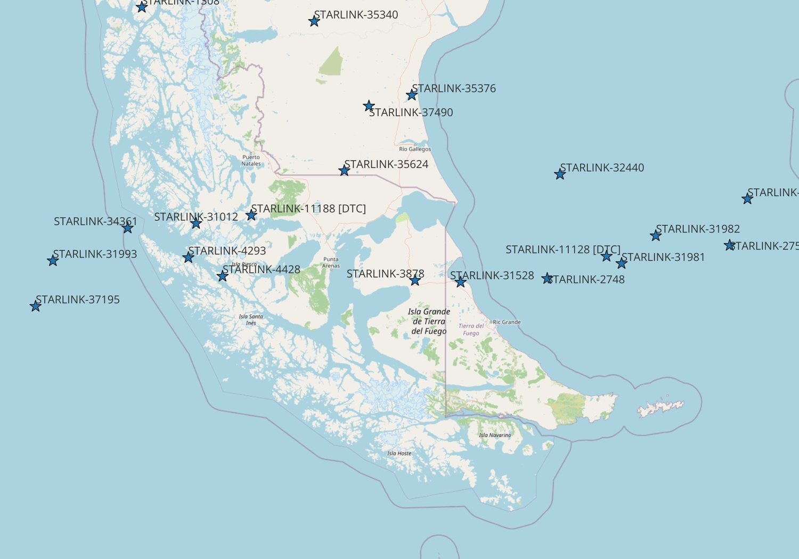
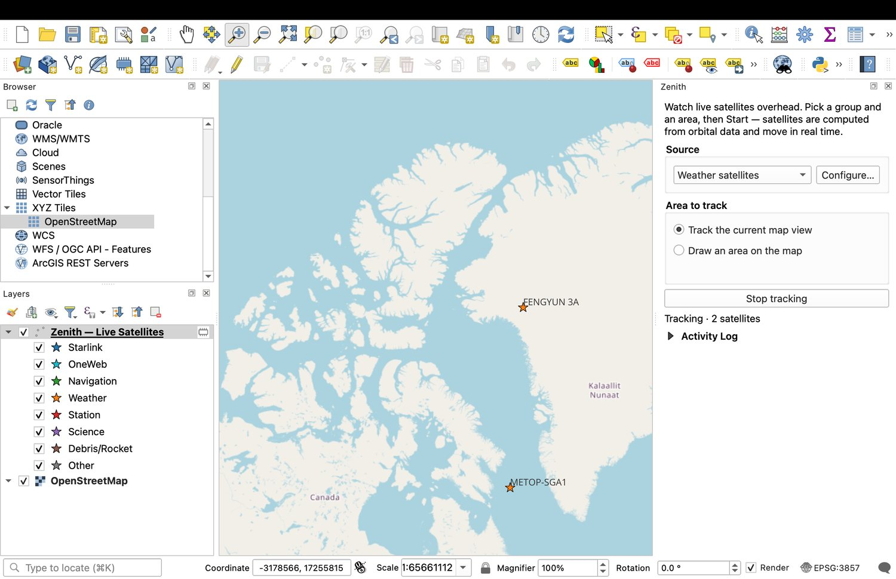
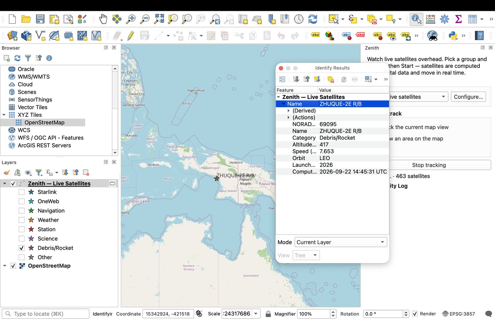

# Zenith

Watch **live satellites overhead** on your map. Zenith computes real-time
satellite positions from orbital data and shows them moving across QGIS — track
your current map view, or draw an area to watch. Live only; no history replay.

Zenith is one of three sibling plugins built on the same live-tracking engine — a
pluggable data-source layer, a moving-point map layer, clustering and identify —
covering **sea, sky and space**:

- [Wake](https://github.com/PeterCotroneo/Wake) — marine vessels (AIS)
- [Contrail](https://github.com/PeterCotroneo/Contrail) — aircraft (ADS-B)
- **Zenith** — satellites (this one)

## How it works

Satellites don't broadcast their positions the way ships and aircraft do. Instead
their orbits are published as **TLEs** (two-line element sets) — a compact set of
orbital parameters. Zenith fetches those, free and keyless, from
[CelesTrak](https://celestrak.org/), and then **computes** each satellite's
position on your own machine using the **SGP4** propagator, updating every second.

Computing locally rather than receiving a feed has real advantages:

- **No rate limits** — positions are worked out on your machine, so it updates smoothly.
- **Complete, global coverage** — every catalogued object, everywhere, with none of the receiver-coverage gaps that thin out AIS or ADS-B over the oceans.

## Features

- **Pick a group** — space stations (ISS, Tiangong), the brightest satellites, the GPS constellation, weather satellites, Starlink, or all ~11,000 active satellites.
- **Area-based** — watch everything over your map view or a drawn box.
- **Coloured by constellation/type**, with name, NORAD id, altitude and orbital speed. Zenith also derives the **launch year** (from the international designator) and the **orbit class** (LEO / MEO / GEO). Click a satellite to open it on N2YO.
- **Cluster badges** for busy regions; zoom in and they fan out.
- **No extra dependencies** — the SGP4 propagator (pure-Python `sgp4`, MIT) is vendored, and everything else uses QGIS's own stack, so it installs cleanly from the plugin repository.

## Screenshots

Choose a group and see it coloured by type — here the weather satellites over the
Arctic, with the category legend:

Identify any satellite for its full detail — including the derived orbit class and
launch year (this one's a spent rocket body in low-Earth orbit):

## Install

1. Download this repository as a ZIP (or clone it).
2. In QGIS: **Plugins → Manage and Install Plugins → Install from ZIP**, and select the zipped `zenith/` folder, or copy `zenith/` into your QGIS plugins directory.
3. Enable **Zenith**. A **Zenith** panel appears on the right.

## Usage

1. Choose a **Source** (all keyless — no configuration).
2. Choose **Track the current map view** or **Draw an area on the map**.
3. Click **Start tracking**. Zenith fetches the orbital elements, then satellites stream onto the map and move in real time.

## Notes

- Positions are computed from TLEs, which are accurate to roughly a kilometre and refresh slowly; Zenith caches them for a couple of hours to respect CelesTrak.
- "All active satellites" is the full catalogue — zoom into a region for the clearest view.
- The **Brightest satellites** group is a curated set of naked-eye objects (best seen at twilight); it is not a live "visible from where I am now" filter.

## Credits

Orbit propagation uses the pure-Python
[`sgp4`](https://github.com/brandon-rhodes/python-sgp4) library by Brandon Rhodes
(MIT), vendored under `zenith/vendor/`. Orbital elements from
[CelesTrak](https://celestrak.org/).

## License

GPL-2.0-or-later.
